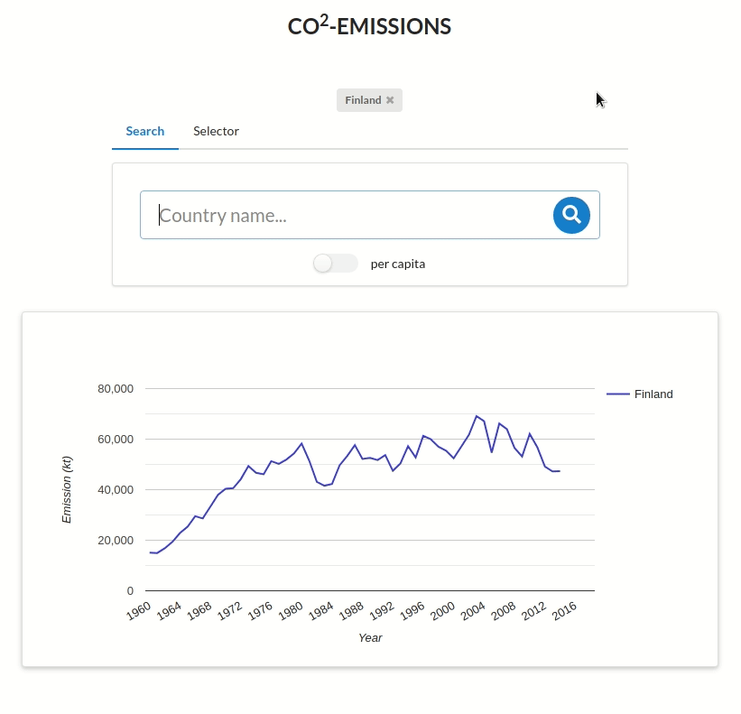
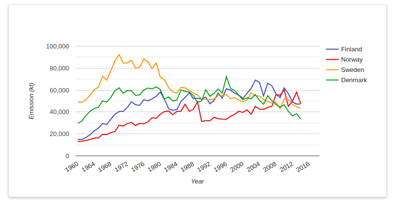
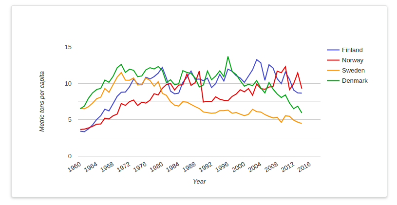
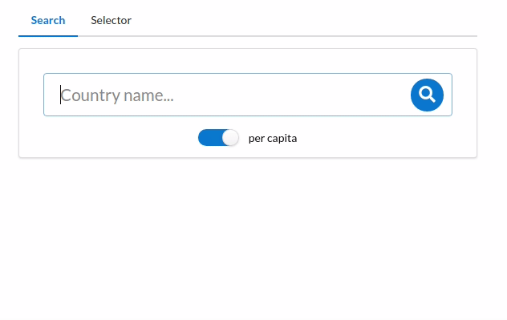
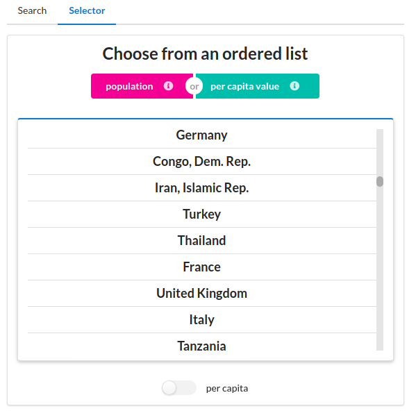
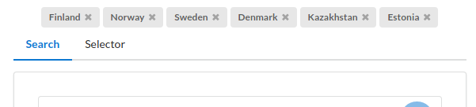

# About

This is the frontend for an application that allows viewing emission data.

Working demo can be found [here](https://co2emissione.herokuapp.com/). (Works on mobile and desktop)

[The full assignment in Finnish.](https://www.reaktor.com/ennakkotehtava-ohjelmistokehittaja/)

[Backend code](https://github.com/k0tix/co2server)

## Features

### Chart

### Search field

Search field with autofilling.

### Selector

Choose countries and areas from the selector menu. It gives a list based on population and another list based on per capita value.

### Countrybar

Compare different countries.

### `npm install`

### `npm start`

Runs the app in the development mode. 
Open [http://localhost:3000](http://localhost:3000) to view it in the browser.

The page will reload if you make edits. 
You will also see any lint errors in the console.

### `npm run build`

Builds the app for production to the `build` folder. 
It correctly bundles React in production mode and optimizes the build for the best performance.

The build is minified and the filenames include the hashes. 
Your app is ready to be deployed!

See the section about [deployment](https://facebook.github.io/create-react-app/docs/deployment) for more information.
